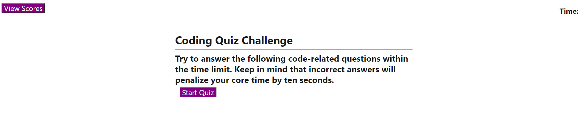
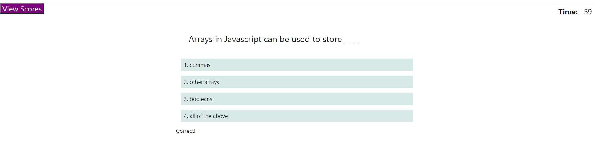
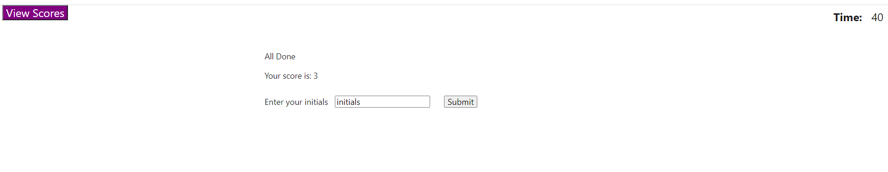
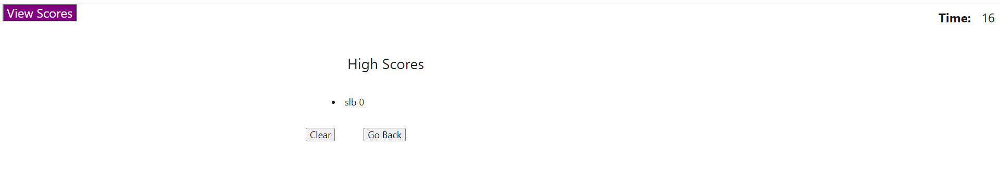
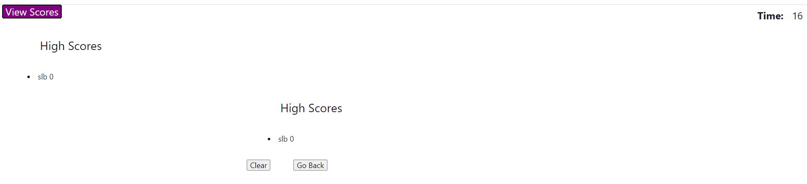
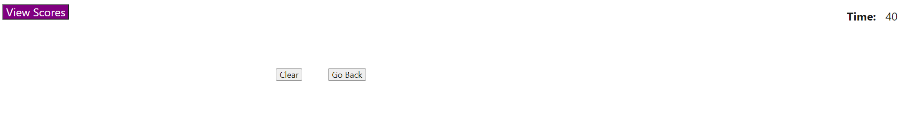
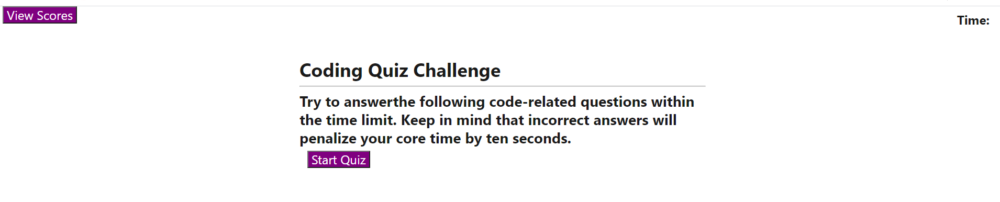

This application asks a series of code related questions and allows the user to store their score in local storage.
When the user clicks on the Start button, a timer counts down from 75 seconds.

In the top section of each page is displayed a button labelled 'View Scores' and a timer count.
If the user clicks on the 'View Scores' button then the list from local storage of users and their scores will be displayed.

When the user is selected with a question, if they click on the correct answer then the text 'Correct!' will be displayed otherwise for 
incorrect responses the text 'Wrong!' is displayed.  A wrong answer will subtract 10 from the time counter.

When either the user has answered all questions or the timer has reached zero, a page displaying their score will be displayed and they
will be able to enter their initials.

At this stage of development, user details in local storage are overwritten with each execution of the quiz.

On the final page users can either elect to clear their user score by clicking on the 'Clear' button or clicking on the 'Go Back' button which will restart the quiz.

Link

The link to the deployed application is : https://susanne85.github.io/codeQuiz/

The following screen shots show the appearance of the application.

Initial page display.

When the user answers a question correctly.

Final display at the end of all questions or time limit has expired.

Viewing High Score.

Viewing scores in local storage.

Clearing Scores in local storage.

Going back to the start of the Quiz.

